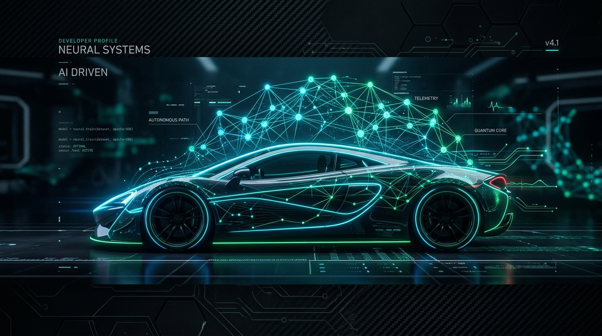
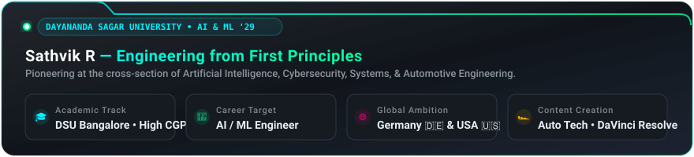
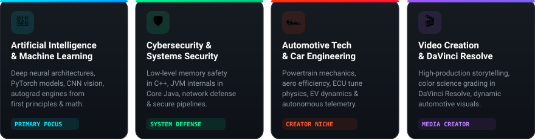
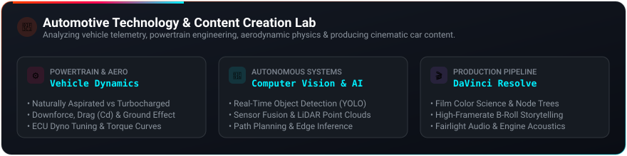

<div align="center">

<!-- Hero Banner Capsule -->


<!-- Typing Subhead -->
<a href="https://git.io/typing-svg">
  
</a>

<br/>

<!-- Profile Badges Bar -->
<p align="center">
  <a href="https://sathvikr.vercel.app" target="_blank">
    
  </a>
  <a href="mailto:sathvik.aiml@dsu.edu.in">
    
  </a>
  <a href="https://github.com/sathviik27">
    
  </a>
  <a href="https://linkedin.com" target="_blank">
    
  </a>
  <a href="https://kaggle.com" target="_blank">
    
  </a>
  
</p>

</div>

---

<!-- Cinematic Visual Graphic & Profile Overview -->
<div align="center">
  
  <br/><br/>
  
</div>

<br/>

## 👨‍💻 Executive Summary

> *"Learn the mechanics before the abstractions. The deepest technological edge comes from first-principles mastery: pointer arithmetic in C++, OOP design in Core Java, vectorized linear algebra in Python, and the mathematics driving neural backpropagation."*

I am **Sathvik R**, an Artificial Intelligence & Machine Learning undergraduate at **Dayananda Sagar University (DSU), Bangalore** (School of Engineering • Class of 2029). 

My work bridges algorithmic discipline with high-impact systems engineering. While pursuing a high CGPA and deep computer science fundamentals, I am expanding my technical boundaries across **Artificial Intelligence, Cybersecurity, and High-Performance Systems**, alongside an active passion as an **Automotive Technology & Car Content Creator** utilizing **DaVinci Resolve**.

### 🌟 The Sathvik Brand Equation
```
Personal Brand = [ AI / Machine Learning ] + [ Cybersecurity & Systems ] + [ Automotive Engineering & Video Creation ]
```

- 🎯 **Career Target**: AI / ML Engineer & Autonomous Systems Researcher
- 🌐 **Global Aspirations**: Exploring research & industry opportunities in **Germany 🇩🇪** and the **USA 🇺🇸**
- 📚 **Academic Commitment**: Disciplined coursework at DSU Bangalore aiming for academic excellence and a stellar CGPA
- 🏎️ **Creative Channel**: Automotive storytelling, vehicle telemetry, aerodynamics breakdowns, and DaVinci Resolve cinematography

---

## 🏛️ Four Core Pillars

<div align="center">
  
</div>

<br/>

<table>
  <tr>
    <td width="50%" valign="top">
      <h3>🧠 1. Artificial Intelligence & Machine Learning</h3>
      <ul>
        <li><strong>First-Principles Deep Learning:</strong> Autograd engines, computational graphs, and loss surfaces built from mathematical foundations.</li>
        <li><strong>Architectures:</strong> Convolutional Neural Networks (CNNs), Vision Transformers, and quantized LLMs.</li>
        <li><strong>Applied AI & RAG:</strong> Vector indexing with ChromaDB, LangChain pipelines, and zero-latency client inference.</li>
      </ul>
    </td>
    <td width="50%" valign="top">
      <h3>🛡️ 2. Cybersecurity & Low-Level Systems</h3>
      <ul>
        <li><strong>Memory Safety & Low-Level CS:</strong> Deep exploration of memory management, pointer safety, and cache locality in <strong>C++</strong>.</li>
        <li><strong>JVM Architecture:</strong> Garbage collection mechanics, concurrency, and thread-safe design in <strong>Core Java</strong>.</li>
        <li><strong>Defensive Engineering:</strong> Secure API endpoints, network protocols, vulnerability analysis, and zero-trust mindset.</li>
      </ul>
    </td>
  </tr>
  <tr>
    <td width="50%" valign="top">
      <h3>🏎️ 3. Automotive Technology & Engineering</h3>
      <ul>
        <li><strong>Powertrain Dynamics:</strong> Naturally aspirated vs. forced induction (turbo/supercharging), torque curves, and ECU remapping physics.</li>
        <li><strong>Aerodynamics:</strong> Downforce generation, ground effects, drag coefficients ($C_d$), and active aero flaps.</li>
        <li><strong>Next-Gen Mobility:</strong> EV battery thermal runaway mitigation, regenerative braking, inverter telemetry, and autonomous LiDAR perception.</li>
      </ul>
    </td>
    <td width="50%" valign="top">
      <h3>🎬 4. Content Creation & DaVinci Resolve</h3>
      <ul>
        <li><strong>Cinematic Video Production:</strong> High-production-value technical and automotive video creation.</li>
        <li><strong>DaVinci Resolve Suite:</strong> Mastering color science, node-based grading, Fusion motion graphics, and Fairlight sound design.</li>
        <li><strong>Education & Outreach:</strong> Translating intricate automotive engineering and AI concepts into captivating visual stories.</li>
      </ul>
    </td>
  </tr>
</table>

---

## 🛠️ Technical Stack & Toolbelt

<div align="center">

### 💻 Core Programming Languages


### 🧠 AI, Machine Learning & Scientific Computing


### 🛡️ Systems, Security & Developer Environments


### 🏎️ Creative Studio & Video Production


</div>

---

## 🚀 Featured Projects & Systems

<table width="100%">
  <tr>
    <td width="50%">
      <h3>👁️ VisionDigit: In-Browser CNN Recognizer</h3>
      <p>A 4-layer Convolutional Neural Network trained on MNIST with Batch Normalization, Dropout, and live zero-latency inference on an HTML5 canvas.</p>
      <p>
        
        
        
      </p>
      <a href="https://sathvikr.vercel.app/#playground"><strong>View Live Interactive Studio »</strong></a>
    </td>
    <td width="50%">
      <h3>☕ JavaMatrix: Zero-Dependency Tensor Engine</h3>
      <p>Built an object-oriented multi-dimensional tensor computation and automatic differentiation engine entirely from scratch in Core Java (JDK 21).</p>
      <p>
        
        
        
      </p>
      <a href="https://github.com/sathviik27"><strong>Explore Engine Code »</strong></a>
    </td>
  </tr>
  <tr>
    <td width="50%">
      <h3>💬 SentimentPulse: DistilBERT NLP Stream</h3>
      <p>Fine-tuned DistilBERT transformer on 50,000 text reviews to detect nuanced emotion polarity with token-level attention heatmaps and INT8 quantization.</p>
      <p>
        
        
        
      </p>
      <a href="https://sathvikr.vercel.app/#playground"><strong>Test Model Online »</strong></a>
    </td>
    <td width="50%">
      <h3>📚 DSU CourseSpark: AI Academic Tutor</h3>
      <p>Retrieval-Augmented Generation (RAG) assistant indexing Dayananda Sagar University STEM lecture notes and curriculum into ChromaDB vector store.</p>
      <p>
        
        
        
      </p>
      <a href="https://sathvikr.vercel.app/#projects"><strong>Read Architecture Spec »</strong></a>
    </td>
  </tr>
</table>

---

## 🏁 Automotive Technology & Content Creation Lab

<div align="center">
  
</div>

<br/>

I combine my engineering mindset with a relentless passion for the automotive world:

- 🏎️ **Vehicle Dynamics & Aerodynamics:** Analyzing downforce coefficients ($C_l$), drag reduction systems ($DRS$), ground effect venturi tunnels, and high-speed cornering stability.
- ⚙️ **Powertrain Engineering:** Deep-diving into the physics of internal combustion, twin-scroll turbocharging, anti-lag systems, and electric motor torque density.
- 🤖 **Autonomous Telemetry:** Understanding LiDAR perception, sensor fusion with Kalman filters, SLAM (Simultaneous Localization and Mapping), and edge neural network acceleration.
- 🎬 **Cinematography & Editing:** Producing cinematic automotive breakdowns with **DaVinci Resolve**, mastering color management (ACES / DaVinci YRGB Color Managed), sound design, and speed-ramp pacing.

---

## 📊 Live GitHub Analytics

<div align="center">

<table>
  <tr>
    <td align="center" width="50%">
      
    </td>
    <td align="center" width="50%">
      
    </td>
  </tr>
  <tr>
    <td colspan="2" align="center">
      
    </td>
  </tr>
</table>

</div>

---

## 🌍 Academic Roadmap & Global Vision

```
  [ 2026: DSU Year 1 ]                [ 2027: Systems & R&D ]                [ 2028-2029: Global Impact ]
   • First-Principles CS Foundations   • Advanced Neural Architectures        • International AI/ML Engineering
   • C++ DSA & Core Java Concurrency   • Cybersecurity Defense Specialization • Industry & Research (Germany 🇩🇪 / USA 🇺🇸)
   • Calculus & Linear Algebra (High CGPA) • Auto Tech Creator Growth (DaVinci)  • Autonomous & High-Scale Systems
```

- 📍 **Current Base:** Bengaluru, Karnataka, India
- 🎯 **Target Destinations:** **Germany 🇩🇪** (Automotive Engineering & AI Hubs) & **USA 🇺🇸** (Deep Tech & AI Labs)
- 🤝 **Open For:** Research Collaborations, High-Impact Open Source Projects, and Technical Discussions

---

## 📬 Connect & Collaborate

<div align="center">

<p>
  <a href="mailto:sathvik.aiml@dsu.edu.in">
    
  </a>
  <a href="https://sathvikr.vercel.app" target="_blank">
    
  </a>
  <a href="https://linkedin.com" target="_blank">
    
  </a>
  <a href="https://github.com/sathviik27">
    
  </a>
</p>

<!-- Footer Wave Decoration -->


</div>
